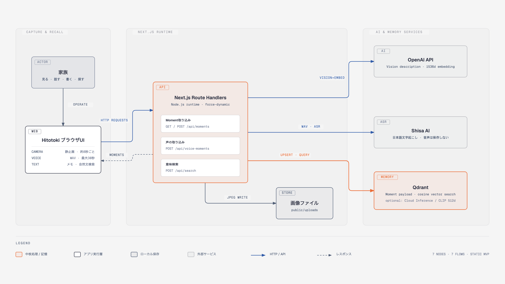

# Hitotoki

**A searchable memory for your baby's life.**

Hitotokiは、カメラが捉えた小さな瞬間と親のひとことを、あとから自然な言葉で探せる「家族の記憶」にするハッカソンMVPです。

## アーキテクチャ



実装に基づく詳細版は [`docs/hitotoki-demo-architecture.html`](docs/hitotoki-demo-architecture.html) で確認できます。

## MVPでできること

- ブラウザのWebカメラを表示し、記憶モード中は約8秒ごとに静止画を取得
- OpenAIのVision対応モデルで、静止画から短い日本語説明を生成
- ボタンを押して話した親のひとことをShisa AIで文字起こし
- カメラMomentと手入力Momentを同じQdrantコレクションへ保存
- OpenAIで検索可能な説明文ベクトルを作り、Qdrantで意味検索
- 利用可能なクラスタではQdrant Cloud InferenceのCLIP画像・テキスト検索へ切り替え可能

動画は保存しません。静止画はハッカソン用の簡易実装として `public/uploads` に保存され、QdrantにはURLとMomentのメタデータだけが入ります。

## 最短セットアップ（Qdrant Cloud無料クラスタ）

前提: Node.js 20.9以降、OpenAI API key、Shisa API key、Qdrant Cloud clusterとAPI key。

```bash
npm install
cp .env.example .env.local
```

`.env.local` を編集します。

```env
OPENAI_API_KEY=sk-...
OPENAI_VISION_MODEL=gpt-4.1-mini
OPENAI_EMBEDDING_MODEL=text-embedding-3-small

SHISA_API_KEY=shsk:...
SHISA_ASR_URL=https://api.shisa.ai/asr/srt/audio_llm

QDRANT_URL=https://YOUR-CLUSTER.cloud-region.cloud-provider.cloud.qdrant.io
QDRANT_API_KEY=...
QDRANT_INFERENCE_MODE=openai
QDRANT_COLLECTION=hitotoki_moments_openai
QDRANT_VECTOR_SIZE=1536
```

この構成では、カメラMomentはVisionモデルが生成した説明文をOpenAIでembeddingし、Qdrantをベクトルの保存・検索層として使います。

```bash
npm run dev
```

[http://localhost:3000](http://localhost:3000) を開き、カメラ利用を許可してください。

## ローカルQdrantで動かす場合

```bash
docker run --name hitotoki-qdrant -p 6333:6333 qdrant/qdrant
```

`.env.local` のQdrant設定を切り替えます。このモードでは説明文をOpenAIで埋め込み、Qdrantは検索・保存層として使います。

```env
QDRANT_URL=http://localhost:6333
QDRANT_API_KEY=
QDRANT_INFERENCE_MODE=openai
QDRANT_COLLECTION=hitotoki_moments_openai
QDRANT_VECTOR_SIZE=1536
```

Cloud Inference（512次元）とOpenAI embeddings（1536次元）はベクトル空間が異なるため、モードを切り替えるときは別のコレクション名を使ってください。

## Qdrant Cloud Inferenceで画像を直接embeddingする場合

Cloud Consoleの **Inference** タブでCLIPの画像・テキストモデルが利用可能なクラスタでは、次の構成に切り替えられます。一部のモデルは無料クラスタでは利用できません。

```env
QDRANT_INFERENCE_MODE=cloud
QDRANT_COLLECTION=hitotoki_moments_clip
QDRANT_IMAGE_MODEL=Qdrant/clip-ViT-B-32-vision
QDRANT_TEXT_MODEL=Qdrant/clip-ViT-B-32-text
QDRANT_VECTOR_SIZE=512
```

## 1分デモ

1. 「カメラをはじめる」→「記憶をはじめる」
2. 手を振る、笑う、ボトルを飲む、顔を隠す
3. 「話してMomentを残す」から「お、今手を振ってる！」と声を残す
4. 「ミルクを120ml飲んだ」とメモする
5. 「手を振っていたとき」で検索し、カメラMomentと家族の声を見せる
6. 「最後にミルクを飲んだのは？」で検索し、手動Momentを見せる

## コマンド

```bash
npm run dev       # 開発サーバー
npm run build     # 本番ビルド
npm run lint      # ESLint
npm run typecheck # TypeScript
```

## 実装上の割り切り

- 認証、アカウント、連続動画保存、Neo4jは未実装
- 画像保存はローカルディスクのため、サーバーレス本番環境ではオブジェクトストレージへ置き換える
- 音声はボタン操作で最大30秒録音し、WAVをShisa ASRへ送信する。音声ファイル自体は保存しない
- Qdrantコレクションは初回アクセス時に自動作成
- カメラ画像はOpenAIの画像説明へ送信される。Cloud InferenceモードではQdrantにも送信されるため、実データ利用前に各サービスのデータ取り扱いを確認する

参考: [Qdrant Cloud Inference](https://qdrant.tech/documentation/cloud/inference/)、[Qdrant Inference API](https://qdrant.tech/documentation/inference/inference-api/)、[OpenAI Images and vision](https://developers.openai.com/api/docs/guides/images-vision)
